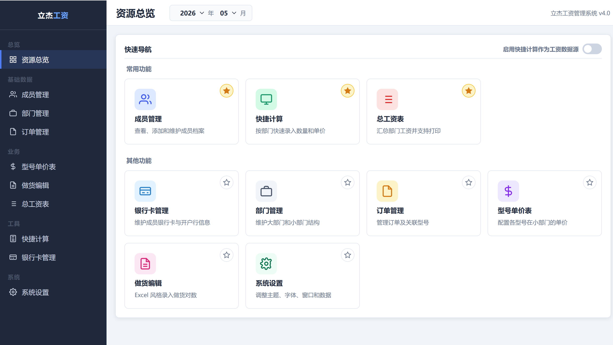
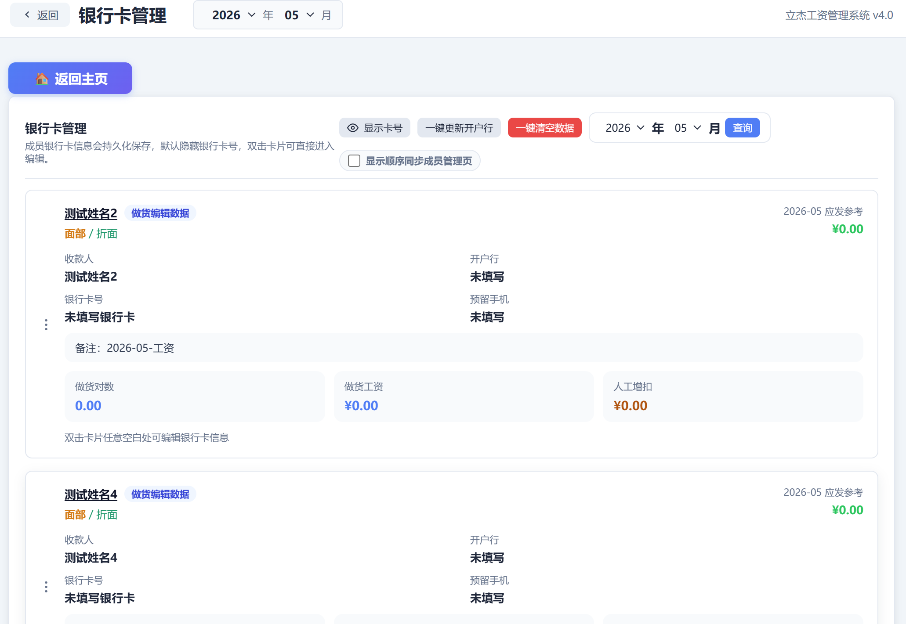
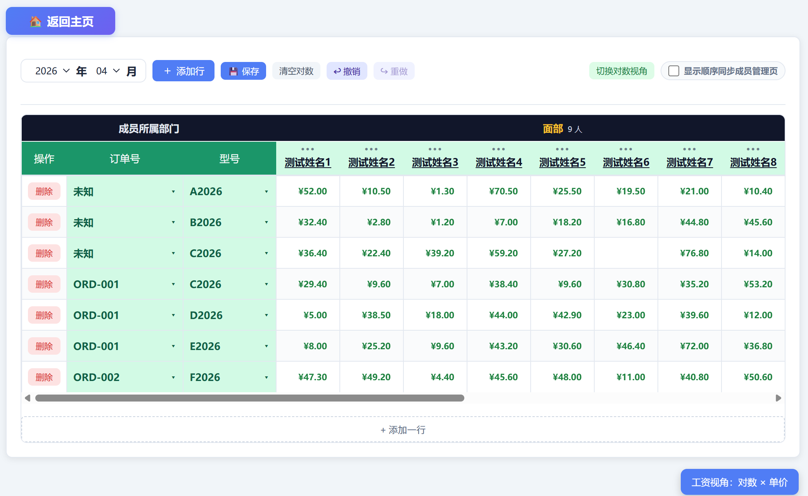

<p align="center">
  
</p>

<h1 align="center">立杰工资管理系统</h1>

<p align="center">
  
  
  
  
  

  
</p>

<p align="center">
  立杰工资管理系统是一款面向个人和小型鞋业加工场景的本地工资管理工具，<br>
  重点解决成员资料、订单型号、做货对数、快捷工资计算、增扣记录、银行卡资料和工资打印等日常事务。
</p>

<p align="center">
  <a href="#界面预览">界面预览</a> · <a href="#快速开始">快速开始</a> · <a href="#功能总览">功能总览</a> · <a href="#打包发布">打包发布</a> · <a href="#故障排查">故障排查</a>
</p>

---

## 项目亮点

- **零门槛部署**：基于 Python + SQLite，无需安装数据库或 Node 环境，下载发行版双击"立杰工资管理系统.exe"直接启动，或下载源码双击 `run.vbs` 即可启动。
- **全离线运行**：数据全部存储在本地 `data.db`，核心工资计算不依赖任何外部服务。
- **双数据源工资计算**：支持"做货编辑"（订单+型号+对数）和"快捷计算"（部门+单价+对数）两种工资录入方式，一键切换。
- **类 Excel 录入体验**：做货编辑页支持 Tab/Enter 键盘导航、自动保存、撤销重做、列拖拽排序、前列冻结。
- **一键打包发布**：通过 PyInstaller 打包为单文件夹 exe，复制到任意 Windows 电脑即可运行，无需安装 Python。
- **个性化定制**：支持浅色/深色/自定义主题、多套配色方案、自定义字体上传、表格字号和布局调整。
- **数据安全**：数据库导入导出、业务数据清理、自动备份，数据迁移零门槛。

---

## 界面预览

### 资源总览

资源总览提供常用功能和其他功能入口，功能卡片支持拖拽排序，也可以自定义是否加入常用功能。



### 成员管理

成员以卡片形式按部门分组展示，支持新增、编辑、删除、批量添加、批量删除、同部门内拖拽换位，以及按名称 Unicode 顺序升序 / 降序排序。


### 成员详情

成员详情展示当月工资汇总、做货明细、快捷计算来源明细和增扣记录。增扣记录支持同月多条，包含日期、增扣对数、增扣工资和理由，可新增、删除和批量删除。


### 银行卡管理

集中展示成员银行卡信息，默认隐藏卡号，支持一键切换完整卡号显示状态、双击卡片编辑、自动保存、一键更新开户行、同部门内拖拽排序，以及与成员管理页显示顺序同步。



### 做货编辑

做货编辑提供类 Excel 表格录入体验，支持订单号 / 型号下拉选择、前列冻结、部门提示行、自动保存、手动保存、清空对数、撤销重做、工资视角切换、列顺序拖拽和行合计实时刷新。




### 快捷计算

快捷计算按大部门分组录入对数和单价，可实时计算行合计、部门合计和全厂合计。快捷计算可作为总工资表和成员详情的工资数据源。


### 总工资表

总工资表按部门汇总全厂工资，支持做货编辑 / 快捷计算双数据源切换、显示顺序同步成员管理页、彩色打印和黑白打印。


### 订单管理与型号单价

订单管理按年月维护订单和关联型号；型号单价表维护不同小部门下各型号单价，是做货编辑计算工资的基础数据。


### 部门管理

部门管理维护大部门 / 小部门两级结构，用于成员归属、快捷计算分组、工资汇总和显示顺序约束。


### 系统设置

系统设置支持外观主题、颜色主题、字体、表格字号、布局、窗口参数、数据库导入导出、业务数据清理和自定义字体管理。


---

## 功能总览

### 基础资料

- 成员管理：维护姓名、性别、大部门、小部门，支持批量添加和批量删除。
- 成员排序：左侧竖向三点手柄用于同部门内拖拽换位；“按名称排序”按钮可按 Unicode 字符码点升序或降序排序，结果写入数据库。
- 部门管理：维护大部门和小部门，两级结构会影响工资汇总、快捷计算分组和成员排序边界。
- 订单管理：按年月维护订单号、备注和关联型号。
- 型号单价：维护型号在不同小部门下的单价，供做货编辑自动计算工资。

### 工资录入与计算

- 做货编辑：以订单、型号、成员为维度录入做货对数，支持同一订单型号组合多行记录。
- 快捷计算：不依赖订单和型号，按部门直接录入对数和单价，适合临时、快速或简化工资计算。
- 工资数据源：可启用“快捷计算作为工资数据源”，总工资表、成员详情和银行卡页的工资参考会同步切换。
- 行合计与总计：做货编辑和快捷计算均支持实时行合计、部门汇总和全厂汇总，避免切换页面后才刷新。
- 保存机制：做货编辑和快捷计算都保留自动保存，同时提供手动保存按钮用于明确反馈。

### 成员详情与增扣

- 成员详情按年月展示个人工资、做货明细和增扣明细。
- 做货明细会跟随工资数据源切换；快捷计算来源下，订单号和型号显示为“来自快捷计算”。
- 增扣记录支持一个成员同一个月多条明细，字段包括增扣日期、增扣对数、增扣工资和增扣理由。
- 增扣记录支持新增、单条删除和批量选中删除。

### 银行卡资料

- 银行卡管理页仅用于资料展示和编辑，不包含打款逻辑。
- 卡片双击进入编辑，默认开户人为成员名，资料自动保存。
- 卡号默认打码显示，顶部眼睛按钮可切换完整显示；完整显示时按每 4 位加空格格式化，显示状态持久化保存。
- 支持一键更新开户行：根据银行卡号调用支付宝公开卡 BIN 接口，并通过 `b.json` 将银行缩写映射为银行全称。
- 支持同部门内拖拽换位和“显示顺序同步成员管理页”。

### 显示顺序与拖拽

- 成员管理页的成员顺序保存在数据库 `employees.sort_order`。
- 总工资表、做货编辑、快捷计算和银行卡管理均提供“显示顺序同步成员管理页”开关。
- 关闭同步后，相关页面可维护自己的手动列 / 卡片顺序；这些偏好写入 `app_settings`，不依赖临时 localStorage。
- 拖拽采用“拖拽项与目标项直接交换”的方式，并带有交换成功动画。

### 打印与显示

- 总工资表提供“彩色打印”和“黑白打印”两个按钮。
- 彩色打印保持当前界面视觉配置，黑白打印使用更适合黑白纸张的打印样式。
- 打印会调用本机 `127.0.0.1:8765` 页面进行浏览器打印。
- 页面文字默认可选中复制，便于复制成员、订单、卡号和工资信息。

### 个性化设置

- 主题模式：浅色、深色、柔和混合、跟随系统。
- 颜色主题：内置多套配色，也支持自定义主要颜色、背景、卡片和文字颜色。
- 字体设置：支持系统字体、自定义字体上传和字体大小调整。
- 表格设置：支持表格字号、密度、行高等显示参数调整。
- 窗口设置：支持分辨率、最大化、全屏等配置，重启后生效。

### 数据维护

- 数据库导入 / 导出：可将当前 `data.db` 导出备份，也可导入 `.db` 文件覆盖当前数据。
- 设置导入 / 导出：可导出界面设置 JSON，也可导入恢复。
- 业务数据清理：可按条件清理做货记录、增扣记录和快捷计算保存数据。
- 单实例运行：Windows 下会阻止重复打开多个程序实例，减少端口冲突和数据误操作。

---

## 快速开始

### 环境要求

- Windows 7 / 10 / 11
- Python 3.8+

### 启动方式

```bat
run.vbs
```

也可以在命令行运行：

```bash
python main.py
```

首次启动会初始化本地数据库，并在 `127.0.0.1:8765` 启动 FastAPI 服务，再由 pywebview 打开桌面窗口。

### 生成测试数据

```bash
python seed_data.py
```

如果需要生成测试用例数据，可运行：

```bash
python seed_data_test.py
```

---

## 打包发布

### 图形菜单打包

```bat
build.bat
```

菜单选项：

- `1`：普通打包，无控制台窗口，推荐日常使用。
- `2`：调试打包，保留控制台窗口，便于排查启动问题。
- `3`：清理 `build/` 和 `dist/`。
- `Q`：退出。

### 命令行打包

```bash
python build.py
python build.py --debug
python build.py --clean
```

打包使用 PyInstaller 的 `--onedir` 模式，产物位于 `dist/立杰工资管理系统/`。发布到其他电脑时，复制整个产物文件夹即可，不需要目标电脑安装 Python。

打包内容包含：

- `web/` 前端页面资源。
- `database/` 数据库结构文件。
- `services/` 后端服务模块。
- `b.json` 银行缩写与银行全称映射。
- `立杰鞋业工资管理系统.ico` 程序图标。

---

## 数据与文件说明

```text
立杰工资管理系统/
├─ main.py                     # 程序入口，启动 FastAPI 与 pywebview
├─ api_server.py               # FastAPI 接口服务
├─ api.py                      # pywebview 桥接 API
├─ services/
│  ├─ db.py                    # 数据库路径、资源路径和初始化
│  └─ crud.py                  # 主要业务 CRUD
├─ database/
│  └─ schema.sql               # SQLite 表结构和默认部门
├─ web/
│  ├─ index.html               # 主界面
│  ├─ css/style.css            # 全局样式
│  └─ js/                      # 前端功能模块
├─ docs/images/                # README 截图资源
├─ fonts/                      # 自定义字体目录
├─ b.json                      # 银行缩写与银行全称映射
├─ data.db                     # 本地 SQLite 数据库，运行后自动创建
├─ window_settings.json        # 窗口尺寸、最大化、全屏等设置
├─ requirements.txt            # Python 依赖
├─ run.bat / run.vbs           # Windows 启动脚本
├─ build.bat / build.py        # 打包脚本
├─ seed_data.py                # 示例数据生成
└─ seed_data_test.py           # 测试数据生成
```

核心数据表：

- `departments` / `sub_departments`：大部门和小部门。
- `employees`：成员资料和成员管理页排序。
- `employee_bank_accounts`：成员银行卡资料。
- `orders` / `order_models`：订单及其关联型号。
- `models` / `model_prices`：型号和各小部门单价。
- `work_records`：做货编辑记录。
- `salary_adjustments`：成员增扣明细。
- `quick_calc_saves`：快捷计算保存数据。
- `app_settings`：工资数据源、显示顺序同步、主题和其他偏好设置。

---

## 常用工作流

### 建立基础资料

1. 在“部门管理”中维护大部门和小部门。
2. 在“成员管理”中添加成员，并按部门调整显示顺序。
3. 在“型号单价表”中维护型号和对应小部门单价。
4. 在“订单管理”中创建订单并关联型号。

### 使用做货编辑计算工资

1. 进入“做货编辑”，选择年月。
2. 添加行，选择订单号和型号。
3. 在成员列录入做货对数，系统自动计算行合计。
4. 进入“总工资表”查看汇总并打印。

### 使用快捷计算计算工资

1. 在首页开启“启用快捷计算作为工资数据源”。
2. 进入“快捷计算”，按部门录入单价和对数。
3. 保存后，总工资表、成员详情和银行卡页会使用快捷计算结果。
4. 如果关闭该开关，系统回到做货编辑数据源。

### 维护银行卡资料

1. 进入“银行卡管理”。
2. 双击成员卡片编辑银行卡、开户人、开户行、预留手机和备注。
3. 如果已填写卡号，可点击“一键更新开户行”自动补全开户行。
4. 需要完整卡号时点击顶部眼睛按钮，状态会在下次启动时保持。

---

## 接口与开发

后端接口默认运行在：

```text
http://127.0.0.1:8765
```

接口文档可参考 [API_DOC.md](API_DOC.md)。常用模块包括：

- `/api/employees`：成员资料。
- `/api/employees/order`：成员管理页排序持久化。
- `/api/bank-accounts`：银行卡资料。
- `/api/bank-lookup`：开户行查询。
- `/api/orders`：订单管理。
- `/api/models` 和 `/api/price-table`：型号与单价。
- `/api/work-records`：做货记录。
- `/api/adjustments`：增扣记录。
- `/api/salary-summary` 和 `/api/qc-salary-summary`：工资汇总。
- `/api/quick-calc-save`：快捷计算保存。
- `/api/app-settings`：系统设置和页面偏好。
- `/api/database/export` 与 `/api/database/import`：数据库备份与恢复。

开发启动：

```bash
pip install -r requirements.txt
python main.py
```

前端为原生 HTML / CSS / JavaScript，不需要 Node 构建步骤。修改 JS 后可用下面命令做基础语法检查：

```bash
node --check web/js/member.js
```

---

## 故障排查

### 127.0.0.1:8765 无法访问

- 确认没有旧程序占用端口。
- 尝试使用 `python main.py` 调试启动，查看控制台错误。
- 如果是打包版，建议先用 `build.bat` 选择调试打包，保留控制台输出。

### 打包后开户行查询失败

- 确认打包产物目录中包含 `b.json`。
- 确认电脑可以访问 `https://ccdcapi.alipay.com/validateAndCacheCardInfo.json`。
- 开户行查询依赖银行卡号的卡 BIN 信息，如果接口未返回 `validated: true`，系统无法准确映射开户行。

### 数据需要备份或迁移

- 推荐在“系统设置 -> 数据”中导出数据库。
- 也可以在程序关闭后复制 `data.db`。
- 打包版的 `data.db` 位于 exe 同级目录。

### 重复启动提示或端口冲突

系统默认启用单实例限制。若异常退出后仍无法启动，可检查是否有残留的 `立杰工资管理系统.exe` 或 `python.exe` 进程。

---

## 许可协议

[MIT](LICENSE) © 2026 立杰工资管理系统
